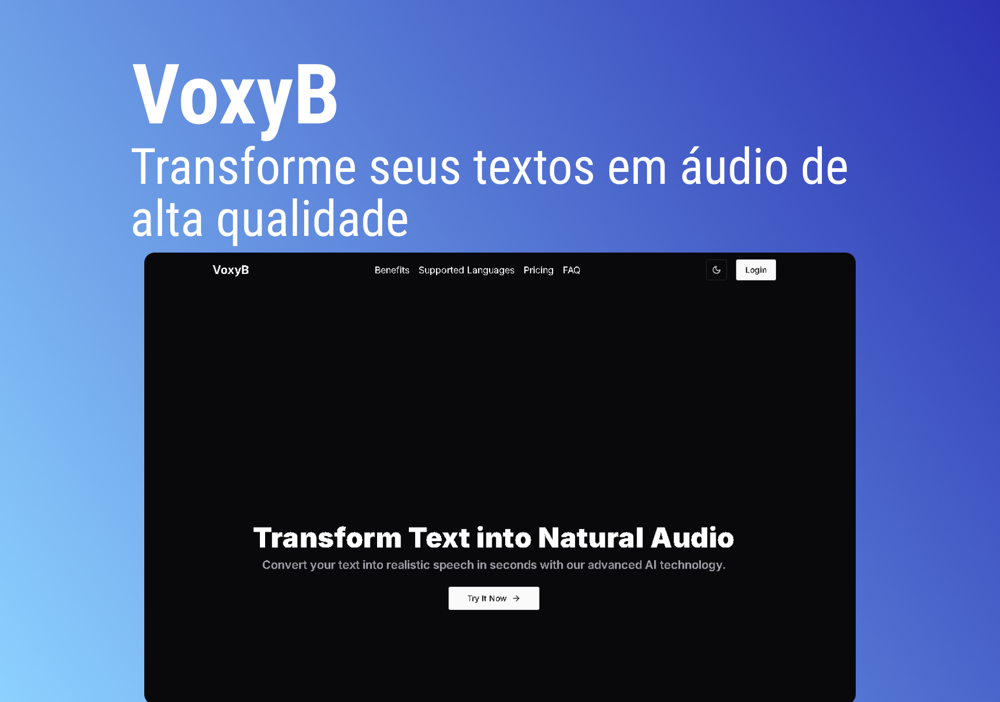

<h1 align="center">VoxyB</h1>

<p align="center">Transforme seus textos em áudio de alta qualidade, pronto para campanhas publicitárias e conteúdo de marketing. Simples, rápido e com vozes profissionais que capturam a atenção do público.</p>



<p align="center">
  <a href="#-tecnologias">Tecnologias</a>&nbsp;&nbsp;&nbsp;|&nbsp;&nbsp;&nbsp;
  <a href="#memo-licença">Licença</a>
</p>

<p align="center">
  
</p>

## 🚀 Tecnologias

Esse projeto foi desenvolvido com as seguintes tecnologias:

### Front-End

- NextJS
- NextAuth
- TailwindCSS
- Cloudflare
- Stripe
- Elevenlabs
- React-Hook-Form
- Zood

## 🚀 Etapas para rodar o projeto

Para iniciar o projeto, siga estas etapas:

> Clone o repositório do projeto:

```bash
git clone https://github.com/diovanealves/voxyb
```

> Agora na pasta web executar os seguintes comando.

```bash
npm install
npm run dev

# A rota padrão da aplicação sera localhost:3000
```

<h2 align="center">Autor</h2>
<table>
  <tr>
    <td>
        
            <a href="https://github.com/diovanealves" style="color:#4f46e5" align="center">
                <p>Github</p>
            </a>
            <a href="https://www.linkedin.com/in/diovane-alves-de-oliveira-5320a0217/" style="color:#4f46e5" align="center">
                <p>Linkedin</p>
            </a>
            <a href="https://twitter.com/deluxyfps" style="color:#4f46e5" align="center">
                <p>Twitter</p>
            </a>
    </td>
  </tr>
</table>

## 📝 Licença

Esse projeto está sob a licença MIT.
